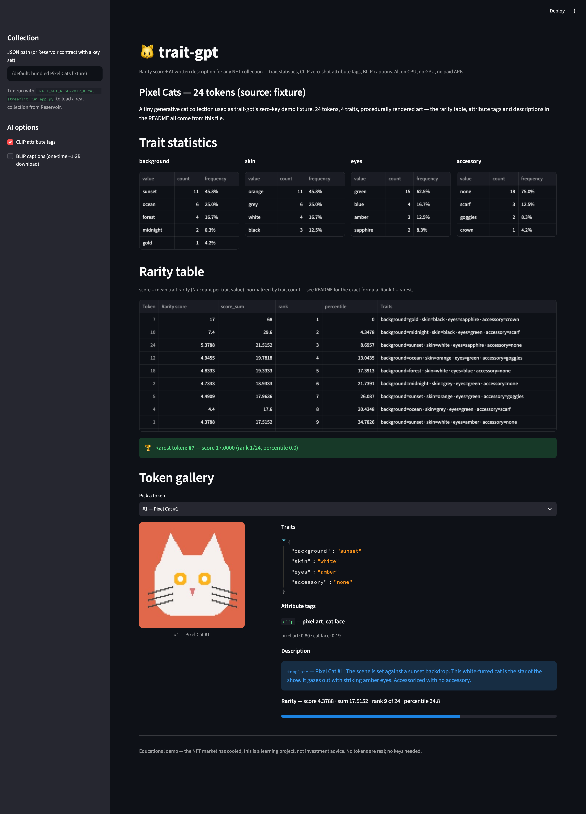
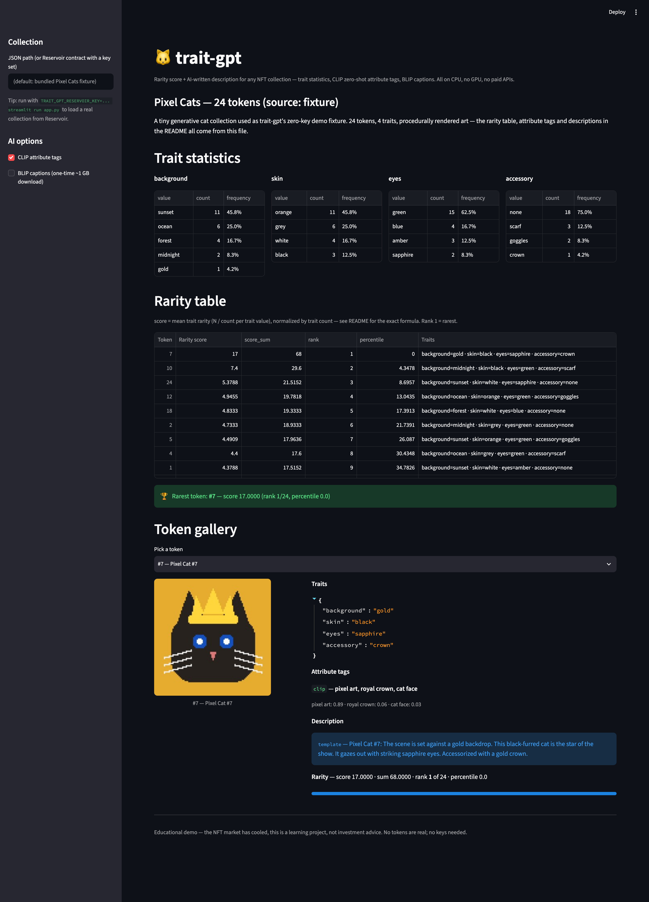

<div align="center">

# 🐱 trait-gpt

### Rarity score + AI-written description for any NFT collection — all on CPU, no GPU, no paid APIs.

**Trait statistics · CLIP zero-shot attribute tags · BLIP captions · Streamlit gallery**

[](https://www.python.org/)
[](https://github.com/pxlcrtiv/trait-gpt/actions)
[](https://github.com/pxlcrtiv/trait-gpt/actions/workflows/ci.yml)
[](https://github.com/pxlcrtiv/trait-gpt/blob/main/LICENSE)
[](https://github.com/pxlcrtiv/trait-gpt)
[](https://huggingface.co/openai/clip-vit-base-patch32)
[](https://github.com/pxlcrtiv/trait-gpt#quickstart)

</div>

---

## The problem

Rarity tools for NFTs are scattered, usually proprietary, often paid, and
almost always built around a single ranking service. The open-source
alternatives assume you have a GPU, a paid API key, or both. And in 2026 the
NFT market has cooled dramatically — which makes the *engineering* worth
learning even if the trading isn't.

## The solution

**trait-gpt** gives any collection (or the bundled demo fixture) a complete
rarity + description pipeline that runs **entirely on a laptop CPU with zero
keys and zero paid services**:

1. **Trait statistics** — per-trait value counts and frequencies.
2. **Rarity score** — a documented, trait-count-normalized formula
   (statistical rarity `N / count`, averaged per token), with competition
   ranking and percentiles.
3. **CLIP zero-shot attribute tags** — `openai/clip-vit-base-patch32` scores
   each token image against a fixed list of visual attributes ("pixel art",
   "royal crown", "vaporwave"…). If the model isn't installed, a curated
   trait→attribute map takes over — always labeled (`clip` vs `keyword`).
4. **Per-token descriptions** — a deterministic trait-interpolated template
   by default, or real BLIP captions (`Salesforce/blip-image-captioning-base`)
   — always labeled (`template` vs `blip`).
5. **Streamlit gallery** — rarity table, trait bars, and a per-token card
   with image, tags, description, and rarity stats.

Everything is pure Python on `transformers` + `pandas`; the rarity math is
`pytest`-golden-tested with hand-computed values.

---

## Quickstart (zero keys, ≤ 5 minutes)

```bash
git clone https://github.com/pxlcrtiv/trait-gpt
cd trait-gpt
python -m venv .venv && source .venv/bin/activate
pip install -r requirements.txt
pip install -e .              # optional: the `trait-gpt` CLI command
streamlit run app.py
```

The bundled **Pixel Cats** fixture collection loads automatically — 24
tokens, 4 traits, procedurally rendered art, no network needed. You get the
rarity table, attribute tags, and descriptions immediately:



Every token gets a full card: rendered art, **CLIP zero-shot tags with real
scores** (when the model is cached), a description, and a rarity breakdown —
open `http://localhost:8501/?token=7` to deep-link the rarest token:



### The CLI does the same thing without the browser

```bash
trait-gpt rank --top 5            # rarest tokens first
trait-gpt stats                   # trait value counts + frequencies
trait-gpt describe 7              # description for token #7
trait-gpt tags 7 --clip           # CLIP tags (allows one-time model download)
trait-gpt rank --json             # machine-readable rarity table
```

Real output on the bundled fixture (`trait-gpt rank`):

```
#     score       sum  rank     pct  token
   7   17.0000   68.0000     1     0.0  #7
  10    7.4000   29.6000     2     4.3  #10
  24    5.3788   21.5152     3     8.7  #24
  12    4.9455   19.7818     4    13.0  #12
```

Its description (template path — no model needed):

> **Pixel Cat #7**: The scene is set against a gold backdrop. This
> black-furred cat is the star of the show. It gazes out with striking
> sapphire eyes. Accessorized with a gold crown.

And once the CLIP model is cached, real zero-shot attribute tags with
scores (`trait-gpt tags 7 --clip`):

```
[clip] pixel art (0.8933) · royal crown (0.0641) · cat face (0.0266)
```

BLIP captions work too and are honest about what they are — on the same
abstract art, BLIP says *"a black and white photo of a woman in a white
dress"*, which is exactly why the trait-grounded template path is the
default. Every result is labeled with the path that produced it.

Real collection? Set `TRAIT_GPT_RESERVOIR_KEY` and pass a contract (details
[below](#reservoir-api-optional)) — or load any JSON matching the
[fixture schema](data/fixtures/pixel-cats.json).

---

## How rarity works

For every trait value `v` seen in the collection:

```
trait_rarity(v) = N / count(v)        # N = total tokens
```

A value held by 1 of 24 tokens scores 24.0; one held by 12 of 24 scores 2.0.
Each token's **rarity score** is the *mean* trait rarity over its own traits:

```
score(token) = (1 / k) * Σ trait_rarity(v)      # k = token's trait count
```

Normalizing by trait count means a token with more traits isn't
automatically "rarer" — every token competes on average scarcity, which is
the property most collectors actually mean by "rare" (the raw `score_sum`
is reported too, for the sum-method crowd). Ranking uses **competition
ranking** ("1224"): equal scores share a rank; `percentile` maps
`rank → 0..100` where **0.0 = rarest** (`100*(rank-1)/(N-1)`).

The [golden tests](tests/test_rarity.py) pin exact values on a tiny
hand-computable collection — 3 tokens, scores `2.25 / 1.50 / 2.25`, ranks
`1 / 3 / 1` — so the formula can't drift from this section.

## Features

| Feature | Where | Notes |
|---|---|---|
| Trait statistics | `trait_gpt/rarity.py` | counts + frequencies, deterministic |
| Rarity score | `trait_gpt/rarity.py` | trait-count-normalized, competition ranking |
| CLIP zero-shot tags | `trait_gpt/clip_tagger.py` | CPU; keyword fallback, always labeled |
| Descriptions (template) | `trait_gpt/describe.py` | trait interpolation, offline, default |
| Descriptions (BLIP) | `trait_gpt/describe.py` | real captions, ~1 GB one-time download |
| Streamlit gallery | `app.py` | rarity table + token cards |
| Collection client | `trait_gpt/collection.py` | bundled fixture (offline) or Reservoir |
| CLI | `trait_gpt/cli.py` | `stats / rank / describe / tags`, JSON output |

## Tech stack

| Layer | Choice | Why |
|---|---|---|
| Language | Python 3.10+ (tested on 3.11/3.12) | transformers + pandas ecosystem |
| Vision | `openai/clip-vit-base-patch32` | tiny enough for CPU zero-shot tagging |
| Captioning | `Salesforce/blip-image-captioning-base` | small BLIP, optional |
| Rarity math | pure Python + pandas | zero deps, deterministic, golden-tested |
| UI | Streamlit | fastest path to a demo gallery |
| Data | bundled JSON fixture | demo works with no keys and no network |

## Testing

```bash
pip install pytest
python -m pytest tests/ -q        # 71 tests; model-dependent tests skip without
                                  # the model cached — the suite is green offline
```

The suite covers golden rarity math (hand-computed values), collection
validation, Reservoir payload parsing (offline sample payloads), mocked CLIP
and BLIP pipelines, procedural render determinism (byte-identical PNGs), the
CLI (in-process), and the Daily Green tip pool. Real-model tests are marked
`slow`/`network` and skip automatically when the model isn't in the HF cache.

## CI

`.github/workflows/ci.yml` runs the suite on Python 3.11/3.12 plus a CLI
smoke pass. **Account note:** GitHub Actions runners currently do not start
on this account (a billing lock on the GitHub account) — the workflow files
are valid and lint-clean, and will execute once the lock is lifted. The
local launchd scheduler keeps the daily green bar meanwhile (see below).

## Daily Green automation

This repo makes one meaningful, dated commit every single day — no empty
commits: each day appends one hand-curated NFT-rarity / AI tip to
`docs/daily-tips.md`, rotated deterministically from a 25-entry pool.

- `scripts/daily_update.py` picks today's tip from `scripts/tips_pool.json`
  (calendar-day rotation), appends it to `docs/daily-tips.md`, commits it as
  `docs: daily trait-gpt tip YYYY-MM-DD` and pushes.
- Idempotent: a day is never committed twice; repeated runs are no-ops.
- Local scheduler (primary): macOS `launchd` runs all portfolio repos at
  **12:07 and 18:07 local** (`~/Library/LaunchAgents/com.pxlcrtiv.daily-green.plist`,
  wrapper `~/portfolio/scripts/daily-green.sh` — auto-discovers this repo,
  no edits needed).
- Cloud fallback: `.github/workflows/daily.yml` runs the same script at
  **12:00 UTC**. Whichever fires first wins the day; if the machine was off
  for days, the next run **backfills every missed day** (one dated,
  non-empty commit per day, max 14).
- Pause: `touch .daily-pause` in the repo root stops this repo only; run log
  lives at `~/.daily-green/daily-green.log`.

## Reservoir API (optional)

trait-gpt is 100% usable without any API. To score a *real* collection:

1. Get a free key from [reservoir.tools](https://reservoir.tools) and set
   `TRAIT_GPT_RESERVOIR_KEY`.
2. Run `streamlit run app.py` and enter a contract address (e.g. BAYC), or:

```bash
trait-gpt rank --collection 0xbc4ca0eda7647a8ab7c2061c2e118a18a936f13d
```

Trait names are merged from Reservoir's split `key`/`value` attributes; the
parser is covered by offline tests. Demo-grade client: one page of up to 50
tokens, no pagination yet.

## Honest caveats

- **The NFT market has cooled** — this is an educational demo of
  rarity/AI pipelines, not investment advice and not a price predictor.
  Rarity ≠ value: the rarest token is not the most desirable one.
- The bundled art is **procedurally generated placeholder pixels**, not real
  NFT art (which is typically copyrighted — hotlinking it into a repo would
  be both fragile and legally iffy). Swap in your own images via the
  `image` field (local path or URL).
- Sage rarity *is not rarity*: this is statistical rarity only. Trait
  weightings by community sentiment are a whole other product.
- CLIP/BLIP are optional downloads (~600 MB / ~1 GB one-time). Without them
  every feature still works through the labeled fallbacks.

## Related repos

- **[model-ledger](https://github.com/pxlcrtiv/model-ledger)** — on-chain provenance for ML models (Solidity + Foundry).
- **[chain-chat](https://github.com/pxlcrtiv/chain-chat)** — crypto data, plain English 🤖 (sibling project).
- [pxlcrtiv](https://github.com/pxlcrtiv) — the rest of the portfolio.

## License

MIT — see [LICENSE](LICENSE). Contributions welcome: read
[CONTRIBUTING.md](CONTRIBUTING.md), check the [CHANGELOG](CHANGELOG.md).